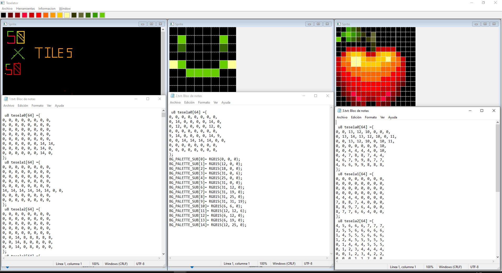

# TESELATOR

## Description
An application where the user can draw into a canvas and convert it into "tiles" (which are 8x8 color-coded matrix) to implement them directly in DevKitPro.

# Installation
Clone the repository, open the .sln and compile.

## Features
+ Create large canvas.
+ Grid based canvas.
+ Customizable color palette.
+ Efficient export method that allows to export huge drawings.
+ Generated file ready to copy and paste.
+ Multiple windows to work in parallel.
+ Zoom 
